<p align="center">
  
</p>

<br/>

<p align="center">
  <a href="https://github.com/salim-khan-3">
    
  </a>
  <a href="https://github.com/salim-khan-3?tab=followers">
    
  </a>
</p>

---

## 🧑‍💻 About Me

```typescript
const selim = {
  name:     "MD Selim Islam",
  role:     "Full-Stack Web Developer",
  location: "Bangladesh 🇧🇩",
  stack:    ["React.js", "Node.js", "TypeScript", "PostgreSQL", "Prisma", "MongoDB"],
  currently: "Building scalable MERN stack applications",
  learning:  "Advanced TypeScript & System Design",
  email:    "salimislam0036@gmail.com",
  openTo:   "Freelance projects & Full-time opportunities",
};
```

---

## 🛠️ Tech Stack

**Frontend**


**Backend**


**Database & ORM**


**Tools & Platforms**


---

## 📊 GitHub Stats

<p align="center">
  
  
</p>

<p align="center">
  
</p>

---

## 🏆 GitHub Achievements

<p align="center">
  
</p>

---

## 📈 Contribution Graph

<p align="center">
  
</p>

---

## 📌 Featured Projects

<p align="center">
  <a href="https://github.com/salim-khan-3/fullstack-ecommerce-react-side">
    
  </a>
  <a href="https://github.com/salim-khan-3/fullstack-ecommerce-mern-ser">
    
  </a>
</p>

---

## 🤝 Connect With Me

<p align="center">
  <a href="mailto:salimislam0036@gmail.com">
    
  </a>
  &nbsp;
  <a href="https://github.com/salim-khan-3">
    
  </a>
</p>

<br/>

<p align="center">
  
</p>

